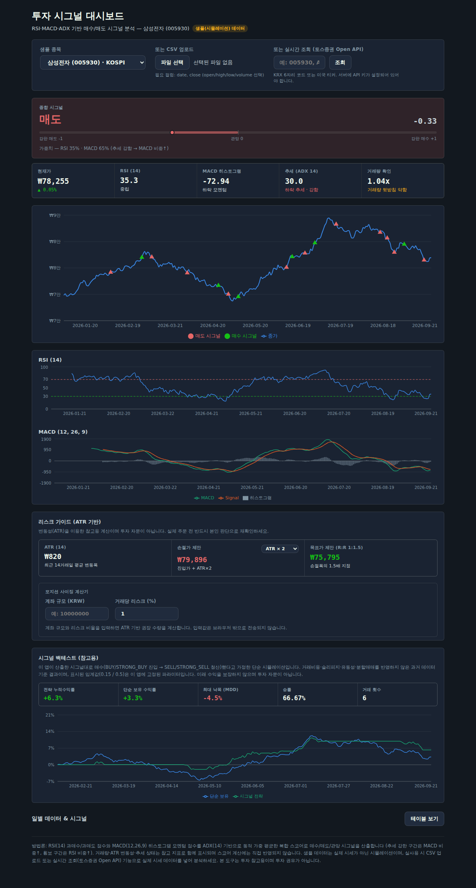
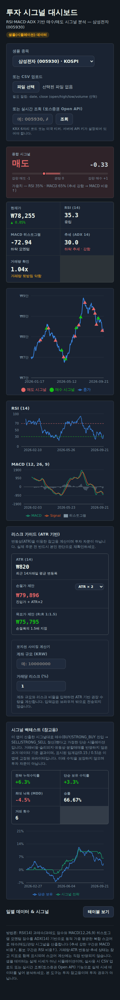

# 투자 시그널 대시보드 (Stock Signal Dashboard)

RSI·MACD·ADX·거래량 네 가지 지표를 계산하고, 이를 ADX(추세 강도) 기반으로 동적 가중
평균한 복합 스코어로 종목별 매수 / 매도 / 관망 시그널을 산출하는 웹 대시보드입니다.
시그널의 과거 성과를 검증하는 간단한 백테스트와, ATR 변동성 기반 손절/목표가·포지션
사이징 계산기도 함께 제공합니다. KOSPI 반도체·AI 종목과 NASDAQ 대형 기술주를 샘플로
제공하며, CSV 업로드 또는 토스증권 Open API 실시간 조회로 실제 데이터를 바로 분석할
수 있습니다.



## 왜 만들었는가

RSI와 MACD는 둘 다 "가격 모멘텀" 계열 지표라 실제로는 서로 강하게 상관돼 있고, 단순히
둘을 가중합하는 것만으로는 "지표 두 개를 섞었다" 이상의 의미를 갖기 어렵습니다. 이
프로젝트는 거기서 한 걸음 더 나가려고 했습니다.

- **추세 강도(ADX)를 제3의 독립적인 축으로 사용**해 RSI/MACD의 가중치 자체를 시장 상태에
  따라 바꿉니다. 추세가 뚜렷할 때는 추세추종형인 MACD를, 횡보장에서는 평균회귀형인 RSI를
  더 신뢰하도록 만든 것입니다.
- **거래량과 변동성(ATR)을 스코어에는 넣지 않되 나란히 표시**해, "점수 계산"과 "그 점수를
  얼마나 신뢰할지 판단하는 것"을 분리했습니다.
- **시그널이 과거에 실제로 유효했는지 백테스트로 확인**할 수 있게 했습니다 — 지표를 몇 개
  썼는지보다, 그 조합이 실제로 성과를 냈는지가 더 중요하다고 봤기 때문입니다.

## 방법론

1. **RSI(14)** — Wilder의 평활화 방식. 30 이하를 과매도, 70 이상을 과매수로 봅니다.
2. **MACD(12, 26, 9)** — EMA 12/26일 차이(MACD 라인)와 9일 신호선, 히스토그램(모멘텀 강도).
3. **ADX(14)** — Wilder 방식의 추세 강도 지표(0~100). 25 이상이면 뚜렷한 추세, 20 미만이면
   횡보(레인지)로 판단합니다. 추세의 "방향"이 아니라 "강도"만 나타냅니다.
4. **추세 상태** — 20일/50일 단순이동평균의 괴리율로 상승/하락/횡보를 분류 (참고 표시용).
5. **ATR(14)** — Wilder 평활화된 평균 실질 변동폭. 손절/목표가·포지션 사이징 계산에 사용.
6. **상대 거래량** — 당일 거래량 ÷ 최근 20일 평균 거래량. 1.2배 이상이면 "거래량 뒷받침"으로
   표시(스코어에는 반영하지 않는 확인용 참고 지표).
7. **정규화**
   - RSI 점수 = `(50 − RSI) / 50` → −1(과매수) ~ +1(과매도) 범위로 스케일링
   - MACD 점수 = 최근 20거래일 히스토그램 절대값 평균 대비 당일 히스토그램의 상대적 크기 (−1~1로 클리핑)
8. **동적 가중치** — ADX ≥ 25(추세장)면 RSI 35% / MACD 65%, ADX < 20(횡보장)이면 RSI 65% /
   MACD 35%, 그 사이는 50/50. (고정 가중치를 직접 지정할 수도 있도록 함수 인자로 분리되어 있음)
9. **복합 스코어** = `가중치RSI × RSI점수 + 가중치MACD × MACD점수`
10. **시그널 분류**: 스코어 > 0.5 → 강한 매수, > 0.15 → 매수, < −0.5 → 강한 매도,
    < −0.15 → 매도, 그 외 → 관망

계산 로직은 `src/utils/indicators.js`에 있으며, 알려진 참조값(추세/횡보 합성 시계열에서의
ADX 방향성, 일정 변동폭에서의 ATR 수렴값 등)으로 단위 검증을 거쳤습니다.

## 주요 기능

- 샘플 종목 5개 (삼성전자, SK하이닉스, 한미반도체, NVIDIA, AMD) 즉시 조회
- **실시간 조회**: 토스증권 Open API로 실제 종목 캔들(OHLCV) 데이터를 조회 (KRX 6자리 코드 /
  미국 티커, 일봉 기준 최근 200봉)
- CSV 업로드로 임의 종목 데이터 분석 (컬럼: `date`, `close` 필수 / `open`, `high`, `low`, `volume` 선택,
  한글 헤더 `날짜`, `종가` 등도 인식)
- **종합 시그널 게이지**: −1~+1 스코어를 시각적 바(bar)로 표시하고, 현재 RSI/MACD 가중치
  비율을 함께 노출해 "왜 이 시그널인지"를 투명하게 보여줌
- **추세·거래량 확인 배지**: ADX 기반 추세 강도, 상대 거래량을 종합 시그널 옆에 표시하고,
  추세가 강한데 반대 방향 시그널이 나온 경우 경고 문구 표시
- **리스크 가이드**: ATR 기반 손절가/목표가(R:R 1:1.5) 제안, 계좌 규모·리스크 비율 입력 시
  포지션 사이징 계산 (계산은 브라우저 안에서만 이뤄지며 입력값은 전송되지 않음)
- **시그널 백테스트**: 이 앱의 시그널대로 매매했다고 가정했을 때의 누적수익률을 단순 보유와
  비교(승률·최대낙폭·거래횟수 포함) — 거래비용/슬리피지 미반영, 참고용
- 가격 차트 위에 매수/매도 **전환 시점**만 마커로 표시 (조건 유지 구간 전체를 찍지 않아 추세
  구간에서도 차트가 지저분해지지 않음)
- RSI·MACD 서브 차트 (과매수/과매도 기준선, 히스토그램 포함)
- 접근성: 시맨틱 heading 구조, 라벨-인풋 연결, 키보드 포커스 스타일, 데이터 테이블
  형태의 대체 뷰, `prefers-reduced-motion` 대응

> ⚠️ 샘플 종목 데이터는 실제 시세가 아닌 시드 기반 시뮬레이션입니다. 실제 데이터로 분석하려면
> CSV 업로드 또는 실시간 조회(토스증권 Open API) 기능을 사용하세요. 백테스트·리스크 가이드는
> 모두 참고용이며 투자 자문이 아닙니다.

## 실시간 데이터 연동 (토스증권 Open API)

`api/toss-candles.js`는 Vercel 서버리스 함수로, 프론트엔드 대신 토스증권 Open API와
통신하는 프록시입니다. `client_secret`은 이 함수 안에서만 사용되며 프론트엔드 코드나
브라우저로는 절대 전달되지 않습니다.

**설정 방법**

1. Vercel 프로젝트 Settings → Environment Variables에 아래 두 값을 등록합니다 (`.env.example` 참고).
   - `TOSS_CLIENT_ID`
   - `TOSS_CLIENT_SECRET`
2. 재배포하면 대시보드 상단 "실시간 조회" 입력창에서 바로 종목을 조회할 수 있습니다.
3. 로컬에서 `/api` 라우트까지 함께 테스트하려면 `vite dev` 대신 `vercel dev`를 사용해야 합니다
   (일반 `npm run dev`는 `/api/*` 서버리스 함수를 실행하지 않으므로, 샘플/CSV 모드만 동작합니다).

**⚠️ 알아둘 점 — 허용 IP 제한과 Vercel 배포**

토스증권 Open API는 클라이언트별로 등록된 "허용 IP"에서만 호출을 허용하며, 등록되지 않은
IP로 요청하면 403 오류가 발생합니다. 반면 Vercel의 기본 서버리스 함수(Hobby/Pro 플랜의
일반 설정)는 고정된 아웃바운드 IP를 제공하지 않습니다 — 즉, 토스증권 WTS에 IP 하나를
등록해도 다음 호출이 다른 IP로 나가면 다시 막힐 수 있습니다. 실사용 전에 다음 중 하나를
확인/적용해야 합니다.

- Vercel의 고정 아웃바운드 IP 기능(예: Secure Compute, 플랜에 따라 상이)을 사용해 고정 IP를
  확보하고 그 IP를 토스증권에 등록
- 고정 IP를 가진 별도 서버(VPS 등)에서 `api/toss-candles.js`와 동일한 로직을 실행하고,
  프론트엔드는 그 서버를 호출하도록 변경

이 제약 때문에 데모/포트폴리오 발표 시점에는 실시간 조회가 403으로 실패할 수 있습니다 —
그 경우에도 샘플 데이터와 CSV 업로드 경로는 정상 동작하므로 발표 자체에는 지장이 없습니다.

**요청 한도**: 토스증권 API는 엔드포인트 그룹별 요청 한도(rate limit)가 있으며, 초과 시 429와
함께 `Retry-After` 헤더가 내려옵니다. 현재 프록시는 캔들 조회 실패 시 사용자에게 한국어
오류 메시지를 그대로 보여주며, 별도의 재시도/백오프 로직은 없습니다.

## 기술 스택

- React 19 + Vite
- Recharts (차트)
- PapaParse (CSV 파싱)
- Vercel 서버리스 함수 (`api/toss-candles.js`) — 토스증권 Open API OAuth2 토큰 교환 및 프록시
- 순수 CSS 커스텀 프로퍼티 기반 테마 (Ocean Depths 팔레트 — 금융/신뢰 톤의 다크 네이비 + 틸)
  + 숫자 전용 모노스페이스(JetBrains Mono)로 트레이딩 터미널에 가까운 밀도感
- 차트 색상은 색약 대비(CVD) 검증 절차를 거친 팔레트 사용

## 실행 방법

```bash
npm install
npm run dev       # 개발 서버
npm run build     # 프로덕션 빌드 (dist/)
npm run preview   # 빌드 결과 미리보기
```

## 스크린샷 (모바일)



## 다음 단계로 고려 중인 것

- 볼린저 밴드 등 추가 지표 및 가중치 커스터마이징 UI (현재는 코드 레벨 함수 인자로만 조정 가능)
- 다중 종목 스크리닝(여러 종목을 한 번에 스코어링해 랭킹)
- 백테스트 파라미터(임계값, 손절/청산 조건) 사용자 조정 UI
- 실시간 조회 결과 캐싱 및 요청 한도(rate limit) 대응 재시도 로직

## 포트폴리오 제출 자료

지원서에서 문제 정의, 분석 설계, 토스증권 API 연동 구조, 백테스트와 리스크 관리 결과를 설명할 때는
[`docs/portfolio-case-study.md`](docs/portfolio-case-study.md)를 함께 참고할 수 있습니다. 이 문서는
토스증권 API를 계좌 거래 시스템으로 과장하지 않고, 외부 금융 API를 안전하게 연결해 분석 제품으로
확장한 구현 경험을 중심으로 정리합니다.
