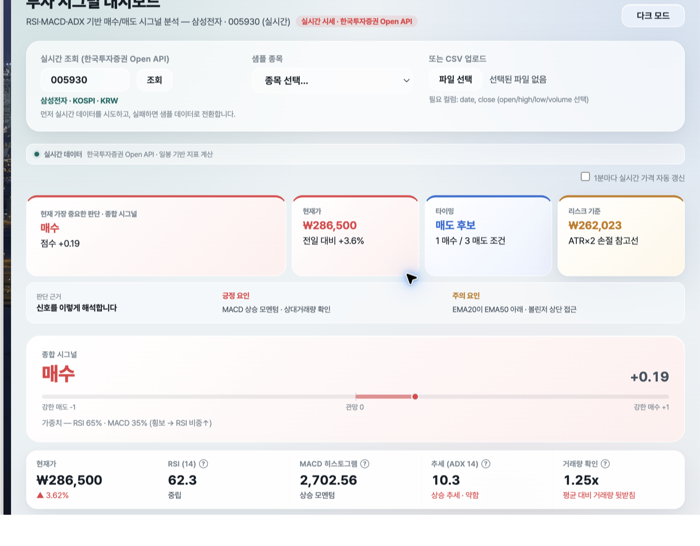

# 투자 시그널 대시보드

> 기술적 지표를 한 화면에 모으고, **시그널 → 판단 근거 → 리스크 → 검증**의 흐름으로 매매 의사결정을 돕는 분석형 웹 대시보드



## 프로젝트 소개

가격이 올랐는지 내렸는지만 보여주는 화면을 넘어, 왜 그런 시그널이 나왔는지와 어느 가격에서 판단이 무효화되는지를 함께 보여주는 것을 목표로 만들었습니다.

RSI와 MACD를 단순히 50:50으로 합산하지 않고, ADX로 시장 상태를 먼저 분류한 뒤 추세장에서는 MACD, 횡보장에서는 RSI의 비중을 높입니다. 이후 EMA·볼린저 밴드·스토캐스틱·거래량·ATR을 함께 확인해 진입 타이밍과 리스크를 분리해서 검토할 수 있도록 설계했습니다.

## 핵심 경험

1. 종목 티커를 입력하거나 샘플 종목을 선택합니다.
2. 실시간 일봉, CSV, 샘플 데이터 중 데이터 출처를 확인합니다.
3. 종합 시그널과 긍정·주의 요인을 한눈에 확인합니다.
4. 매수·매도 타이밍, 시장 포지셔닝, 피어 그룹을 함께 비교합니다.
5. ATR 기반 손절·목표가와 포지션 규모를 검토합니다.
6. 백테스트와 시장 비교로 판단을 검증합니다.

## 주요 기능

### 시그널 분석

- RSI(14), MACD(12, 26, 9), ADX(14), 상대거래량
- ADX 기반 RSI/MACD 동적 가중치
- 종합 점수와 매수·매도·관망 시그널
- 시그널 판단 근거 및 주의 요인 표시
- EMA 20/50, 볼린저 %B, 스토캐스틱, 지지·저항 기반 타이밍 체크
- RSI·MACD 보조 차트와 시그널 전환 마커

### 데이터 경험

- API 키 없이 확인할 수 있는 삼성전자 샘플 데이터
- 한국투자증권 Open API 기반 국내 주식 일봉 조회
- CSV 업로드 분석 (`date`, `close` 필수)
- 실시간·샘플·CSV 데이터 출처 배지
- API 오류·데이터 부족·연결 대기 상태를 구분한 UI
- 실시간 종목 선택 시 1분 단위 자동 갱신

### 의사결정 워크벤치

- 매매 계획: 진입가·무효화 가격·목표가·손익비
- ATR 기반 위험 예산·현금·비중 제한 포지션 사이징
- 이벤트 날짜와 이벤트 이후 평균가격 기준 등록
- 보유 관리: 수익률·추적 손절선·보유기간 재검토
- 저장한 매수 근거와 조건 변화 기록
- 시장·업종 대비 상대수익률과 상대강도 비교

### 검증과 시장 구조

- 시그널 전략과 단순 보유 비교 백테스트
- 거래비용·슬리피지·기간 설정
- 수익률·MDD·승률·거래 횟수·전략 비교
- ETF 편입·선물·옵션 데이터를 통한 시장 포지셔닝 영향 추정
- 피어 그룹 실시간 비교 및 샘플 fallback 표시
- 임의의 미제공 데이터를 만들지 않고 API 연결 대기 상태로 표시

## 시그널 계산 방법

### 동적 가중치

```text
ADX ≥ 25   → RSI 35% / MACD 65%  (추세장)
ADX < 20   → RSI 65% / MACD 35%  (횡보장)
그 사이    → RSI 50% / MACD 50%
```

```text
종합 점수 = RSI 가중치 × RSI 점수 + MACD 가중치 × MACD 점수
```

스코어는 규칙 기반 참고값이며 상승 확률이나 투자 권유가 아닙니다. 거래량과 ATR은 점수를 무리하게 왜곡하지 않도록 신뢰도와 리스크 판단 영역에서 별도로 표시합니다.

## API 연동 구조

브라우저에 앱 키와 시크릿을 노출하지 않기 위해 프론트엔드가 한국투자증권 API를 직접 호출하지 않습니다.

```text
React UI
  ↓ same-origin /api 요청
Vercel Serverless Function
  ↓ OAuth 토큰 발급·캐시
한국투자증권 REST API
  ↓ 응답 정규화
OHLCV 분석·시그널·차트
```

- `api/kis-auth.js`: 서버 측 접근 토큰 캐시
- `api/kis-candles.js`: 국내 주식 일봉 조회 프록시
- `api/kis-positioning.js`: ETF·선물·옵션 시장 데이터 조회 프록시
- 계좌 잔고·주문 기능은 연결하지 않았습니다.
- API가 제공하지 않거나 호출 제한으로 확인할 수 없는 값은 임의 생성하지 않습니다.

## 보안과 데이터 신뢰도

- 앱 키·시크릿은 서버 환경변수에서만 사용
- `.env.local`은 Git에 커밋하지 않음
- 계좌 잔고·주문 API는 사용하지 않음
- 실시간·샘플·CSV·계산 지표를 화면에서 구분
- 샘플 데이터는 시뮬레이션 데이터
- 백테스트는 과거 자료의 규칙 검증용이며 미래 수익을 보장하지 않음

## 기술 스택

- React 19
- Vite
- Recharts
- PapaParse
- Vercel Serverless Functions
- 한국투자증권 Open API
- Pretendard 기반 반응형 UI
- 라이트·다크 테마와 liquid glass 스타일

## 로컬 실행

```bash
pnpm install
pnpm dev
```

API 프록시까지 로컬에서 확인하려면 `.env.local`에 다음 값을 설정합니다.

```env
KIS_APP_KEY=발급받은_APP_KEY
KIS_APP_SECRET=발급받은_APP_SECRET
KIS_ACCOUNT_NO=계좌번호
KIS_ACCOUNT_PRODUCT=01
KIS_ENV=real
```

실제 키는 절대 README나 GitHub에 작성하지 않습니다. Vercel에서는 Project Settings → Environment Variables에 등록한 뒤 재배포합니다.

## 프로젝트 구조

```text
api/                    서버리스 API 프록시·인증
src/components/         시그널·차트·리스크·워크벤치 UI
src/utils/               지표·백테스트·API 응답 정규화
src/data/                샘플 종목 및 시계열
docs/                   포트폴리오 문서·스크린샷
```

## 한계와 개선 방향

- 현재는 국내 주식 일봉 중심이며 초단기 체결 데이터는 지원하지 않습니다.
- ETF 편입 비중·옵션 미결제약정·풋콜 비율은 API 응답 범위와 호출 제한에 따라 일부 미제공될 수 있습니다.
- 시장 포지셔닝은 인과관계가 아닌 동시점 시장 구조를 해석하는 참고 지표입니다.
- 다음 단계로 데이터 신선도 모니터링, 다중 종목 스크리닝, 파라미터 워크포워드 검증을 확장할 수 있습니다.

## 라이선스 및 주의사항

본 프로젝트는 포트폴리오 및 교육 목적의 분석 도구입니다. 표시되는 시그널·리스크 가이드·백테스트 결과는 투자 자문이 아니며, 실제 거래 전 별도의 검토가 필요합니다.
